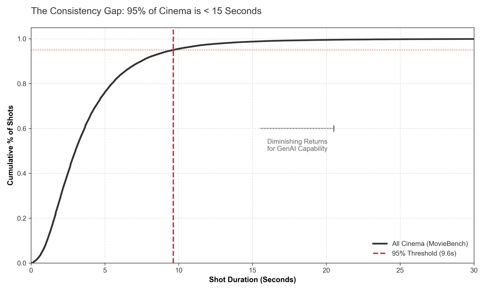
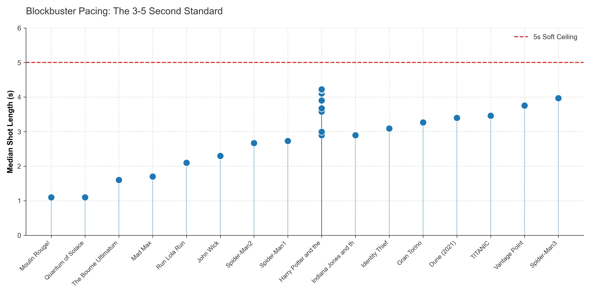
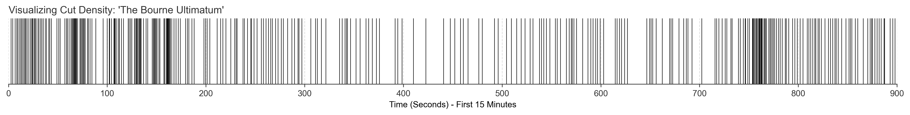

# The 20-Second Ceiling: A Statistical Analysis of Cinematic Shot Duration

## Abstract
An analysis of **57,449 shots** across modern cinema (sourced from MovieBench and Cinemetrics) reveals a statistical ceiling on shot duration. Contrary to current generative video roadmaps which prioritize 60s+ coherence, the data indicates that **95% of narrative filmmaking occurs in under 10 seconds**, with a median shot length of **3.0 seconds**.


*Figure 1: Cumulative Distribution of shot lengths. The curve asymptotes at ~10s, indicating diminishing returns for generation capability beyond this threshold.*

## Key Findings

### 1. The 3-Second Standard (N=57,449)
Aggregating shot-level data from the MovieBench dataset, we established the baseline editorial rhythm of modern cinema.

*   **Median Shot Length:** 3.00 seconds
*   **95th Percentile:** 9.64 seconds
*   **Std Dev:** 3.31 seconds

**Implication:** A model capable of perfect consistency for 5 seconds covers >65% of all editorial needs. A model capable of 15 seconds covers >99%.

### 2. The "20-Second Ceiling" in Blockbusters
We isolated high-VFX blockbusters—the target aesthetic for high-end video models—to test for "long take" dependency. The data shows a rigorous adherence to a <20s ceiling, even in sequences often perceived as continuous.

| Film | Median Shot | Max Shot | % Under 20s |
|------|-------------|----------|-------------|
| **Harry Potter & The Order of the Phoenix** | 3.7s | 15.2s | 100% |
| **The Bourne Ultimatum** | 1.8s | 19.7s | 100% |
| **Indiana Jones & The Last Crusade** | 2.9s | 18.4s | 100% |
| **Mad Max: Fury Road** | 2.6s | 32.9s | 99.1% |



### 3. Visualizing Cut Density
The following visualization represents the temporal structure of *The Bourne Ultimatum*. Each vertical line represents a hard cut.


*Figure 2: Cut frequency visualization. The density of editorial events necessitates high-frequency re-contextualization (consistency across cuts) rather than long-context generation.*

## Methodology
*   **Data Source A:** MovieBench (Shot-level annotations for 600+ films).
*   **Data Source B:** Cinemetrics (Frame-accurate editorial logs for specific case studies).
*   **Processing:** Data was normalized to remove title sequences and credits which skew duration data.

## Reproduction
1. Install dependencies: 
   ```bash
   pip install -r requirements.txt
   ```
2. Run analysis:
   ```bash
   python src/run_analysis.py
   ```
