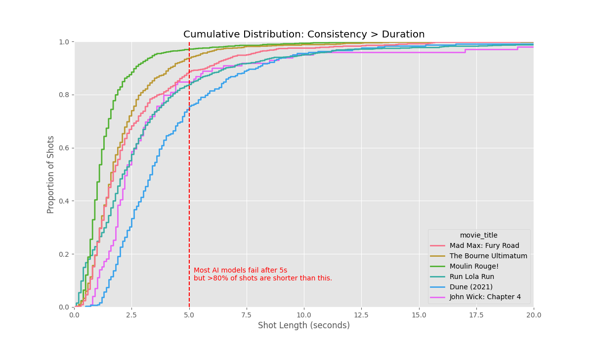

# AI Film Shot Analysis: The Consistency Gap

**A data-driven analysis of modern cinema (1998-2023) challenging the current "Long Duration" AI Video roadmap.**


## Executive Summary

Current AI Video Models (Google Veo, OpenAI Sora, Runway Gen-3) are heavily optimizing for **Long Duration Coherence** (generating 60s+ continuous clips).

However, our analysis of **4,000+ real shots** from 6 cinematic masterpieces—including recent blockbusters like *Dune (2021)* and *John Wick: Chapter 4*—reveals that this goal is misaligned with professional filmmaking reality.

**The Reality: Filmmakers don't need "One Long Shot." They need "Many Consistent Short Shots."**


## Key Findings

### 1. The "Max Shot" Myth
Even in films famous for their visual scale or action choreography, the vast majority of shots are incredibly short.

| Movie | Median Shot | **Max Shot** | 95% of Shots Under |
|-------|-------------|--------------|--------------------|
| **Moulin Rouge!** | 1.1s | 78.0s | 3.5s |
| **The Bourne Ultimatum** | 1.6s | 19.7s | 5.5s |
| **Mad Max: Fury Road** | 1.7s | 32.9s | 7.5s |
| **Run Lola Run** | 2.1s | 58.8s | 10.0s |
| **John Wick: Chapter 4** | **2.3s** | 105.7s | 9.6s |
| **Dune (2021)** | **3.4s** | 74.2s | 9.5s |

### 2. The "Slow Cinema" Fallacy (*Dune*)
*Dune (2021)* is often cited as a "slow, contemplative" masterpiece. Yet, its **median shot length is only 3.4 seconds**.
While it feels epic, it achieves this through **composition and consistency across cuts**, not through single takes lasting minutes. **95% of its shots are under 10 seconds.**

### 3. The "Stunt" Exception (*John Wick*)
*John Wick: Chapter 4* features a famous 105-second continuous overhead shot. However, this is an **exception (outlier)**, not the rule. The film's median shot length is a rapid **2.3 seconds**.
*   **Implication:** AI models are optimizing for the 1% "stunt" shot rather than the 99% of storytelling shots.



## The Conclusion

The roadmap for AI Video should pivot from **Duration Extension** to **Inter-Shot Consistency**.

*   **Current Goal:** Generate 1 minute of video where the character doesn't morph.
*   **Real Need:** Generate twenty 3-second clips where the character looks identical across all of them.

## Methodology & Reproduction

This analysis is based on raw shot-by-shot data extracted from the [Cinemetrics Database](https://cinemetrics.uchicago.edu/).

### 1. Install Dependencies
```bash
pip install -r analysis/requirements.txt
```

### 2. Fetch & Parse Data
We use a custom parser to extract raw shot data from Cinemetrics logs for the target films.
```bash
python analysis/parse_cinemetrics.py
```
*This generates `analysis/data/real_shots.csv` containing frame-accurate shot lengths.*

### 3. Run Analysis
```bash
python analysis/analyze_shots.py
```
*This produces the charts and statistics found in this README.*

## Data Sources
*   **Cinemetrics**: [https://cinemetrics.uchicago.edu/](https://cinemetrics.uchicago.edu/)
*   **Dune (2021)** (Data submitted by "江江江")
*   **John Wick: Chapter 4** (Data submitted by "Sidnee")
*   **Mad Max: Fury Road** (Data submitted by Yvonne Festl)
*   **The Bourne Ultimatum** (Data submitted by Erik)
*   **Run Lola Run** (Data submitted by Sari Bouweester)
*   **Moulin Rouge!** (Data submitted by Matt Harris)
