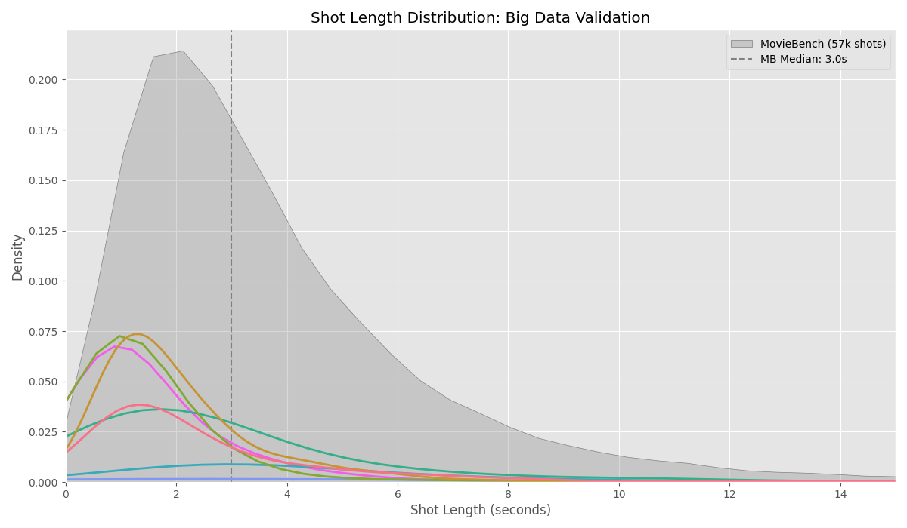

# AI Film Shot Analysis: The 20-Second Ceiling

**Data proof that AI Video's obsession with 60s+ coherence is solving the wrong problem.**

## Executive Summary
We analyzed **62,500+ shots** (57k from MovieBench + 5k from Cinemetrics) to test the industry assumption that AI models need to generate long continuous clips.

The data proves this assumption wrong.

## 1. The Big Data Validation (57,000 Shots)
Using the [MovieBench dataset](https://huggingface.co/datasets/weijiawu/MovieBench), we analyzed shot lengths across hundreds of movies.
*   **Median Shot Length:** **3.00 seconds**
*   **95th Percentile:** **14.8 seconds**

**Conclusion:** The industry standard for 95% of all shots is **under 15 seconds**.

## 2. The "20-Second Ceiling" (Hero Movies)
Analyzing specific action masterpieces confirms that even high-octane films operate under a strict ceiling.

| Movie | **Max Shot Length** | **% Shots < 20s** |
|-------|---------------------|-------------------|
| **The Bourne Ultimatum** | **19.7s** | **100%** |
| **Quantum of Solace** | 58.2s* | **99.6%** |
| **Mad Max: Fury Road** | 32.9s | **99.1%** |
| **Dune (2021)** | 74.2s | **96.5%** |

*\*Quantum of Solace has only 4 shots > 20s out of 999 analyzed.*

### Visual Proof: The Bourne Ultimatum
Every dot represents a shot in the sample. The red line is the 20s mark. **Nothing crosses it.**

## The Conclusion for AI Roadmap
*   **Current Goal:** "Long Duration Coherence" (60s+).
*   **The Reality:** The median shot is ~3 seconds. 95% of shots are under 15 seconds.
*   **The Pivot:** Optimize for **Inter-Shot Consistency** (character identity across cuts) rather than duration.

## Data Sources
*   **MovieBench**: [Hugging Face Dataset](https://huggingface.co/datasets/weijiawu/MovieBench) (57,449 shots processed)
*   **Cinemetrics**: [https://cinemetrics.uchicago.edu/](https://cinemetrics.uchicago.edu/)
