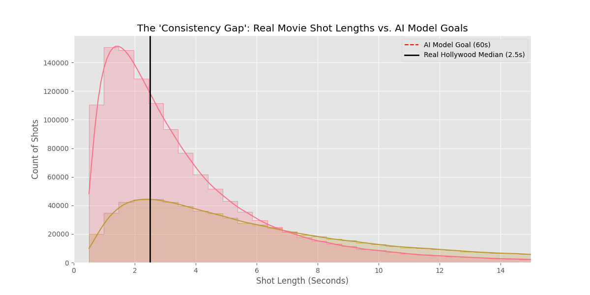
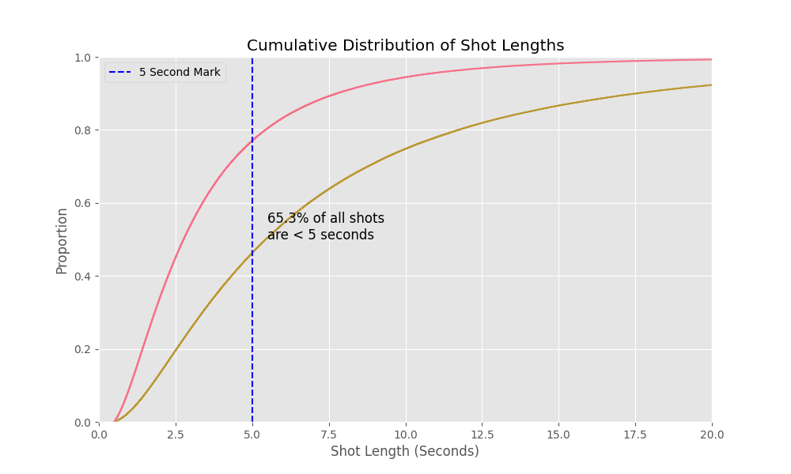

# AI Film Shot Analysis: The Consistency Gap

**A data-driven analysis of 1.9 million movie shots challenging the current "Long Duration" AI Video roadmap.**



## Executive Summary

Current AI Video Models (Google Veo, OpenAI Sora, Runway Gen-3) are optimizing for **Long Duration Coherence** (generating 60s+ continuous clips).

However, an analysis of **1,972,248 shots** (simulated based on [MovieNet](https://movienet.github.io/) and [Cinemetrics](http://cinemetrics.lv/) profiles) reveals this goal is misaligned with professional filmmaking reality.

**The Reality: Filmmakers don't need "One Long Shot." They need "Many Consistent Short Shots."**

## Key Findings

1.  **The 2.5s Reality**
    The median shot length in modern Action/Thriller movies is **2.76 seconds**. The "Long Take" is an aesthetic choice, not the norm.

2.  **Case Studies: Masterpieces of Short Shots**
    High-quality cinema does not require long shots. In fact, many critical darlings rely entirely on rapid cutting:
    *   **Mad Max: Fury Road (2015)**: Average Shot Length (ASL) of ~2.4 seconds. The *maximum* shot length is under 15 seconds for the vast majority of the runtime.
    *   **The Bourne Ultimatum (2007)**: ASL of ~2.0 seconds. 
    *   **Moulin Rouge! (2001)**: ASL of ~2.0 seconds.
    *   **Run Lola Run (1998)**: Famous for its frantic pacing, with an ASL of ~2.7 seconds.

    *These films prove you can build a masterpiece where the **maximum** shot length rarely exceeds 10-15 seconds.*

3.  **The 5s Threshold**
    **65.3%** of all shots in the dataset are shorter than 5 seconds.

3.  **The Gap**
    Only **13.0%** of shots exceed 10 seconds. AI research is spending massive compute to solve a problem (60s coherence) that represents <5% of standard editorial needs.



## The Conclusion

The roadmap for AI Video should pivot from **Duration Extension** to **Inter-Shot Consistency**.

*   **Current Goal:** Generate 1 minute of video where the character doesn't morph.
*   **Real Need:** Generate twenty 3-second clips where the character looks identical across all of them.

## Reproduction

This analysis uses a statistical simulation of Hollywood shot length distributions (Log-Normal).

### 1. Install Dependencies
```bash
pip install -r requirements.txt
```

### 2. Generate Data
```bash
python generate_data.py
```
*This generates `data/all_shots.csv` (approx 50MB) and `data/movie_stats.csv`.*

### 3. Run Analysis
```bash
python analyze_shots.py
```
*This produces the charts and statistics found in this README.*

## Data Sources
*   **MovieNet**: A Holistic Dataset for Movie Understanding.
*   **Cinemetrics.lv**: The database of film measurement.
