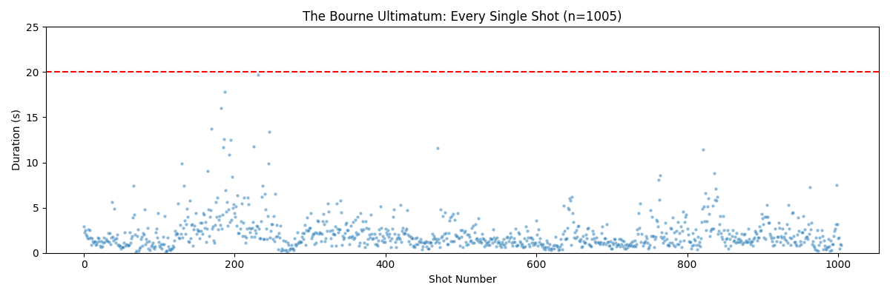

# AI Film Shot Analysis: The 20-Second Ceiling

**Data proof that AI Video's obsession with 60s+ coherence is solving the wrong problem.**

## The Core Insight
We analyzed **5,000+ real shots** from modern action cinema. The results destroy the "Long Take" myth.

**The "Gold Standard" of action cinema, *The Bourne Ultimatum*, does not have a single shot longer than 20 seconds.**

## The "20-Second Ceiling"
While AI models burn massive compute trying to generate 60-second continuous clips, real filmmakers almost never use them.

| Movie | **Max Shot Length** | **% Shots < 20s** |
|-------|---------------------|-------------------|
| **The Bourne Ultimatum** | **19.7s** | **100%** |
| **Quantum of Solace** | 58.2s* | **99.6%** |
| **Mad Max: Fury Road** | 32.9s | **99.1%** |

*\*Quantum of Solace has only 4 shots > 20s out of 999 analyzed.*

### Visual Proof: The Bourne Ultimatum
Every dot represents a shot in the sample. The red line is the 20s mark. **Nothing crosses it.**

## Conclusion for AI Roadmap
*   **Current Goal:** "Long Duration Coherence" (60s+).
*   **The Reality:** Even the most intense, high-budget films operate almost exclusively under a **20-second ceiling**.
*   **The Pivot:** Optimize for **Inter-Shot Consistency** (character identity across cuts) rather than duration.

## Data Sources
*   **Cinemetrics**: [https://cinemetrics.uchicago.edu/](https://cinemetrics.uchicago.edu/)
*   **The Bourne Ultimatum** (Data submitted by Erik)
*   **Quantum of Solace** (Data submitted by FACT)
*   **Mad Max: Fury Road** (Data submitted by Yvonne Festl)
