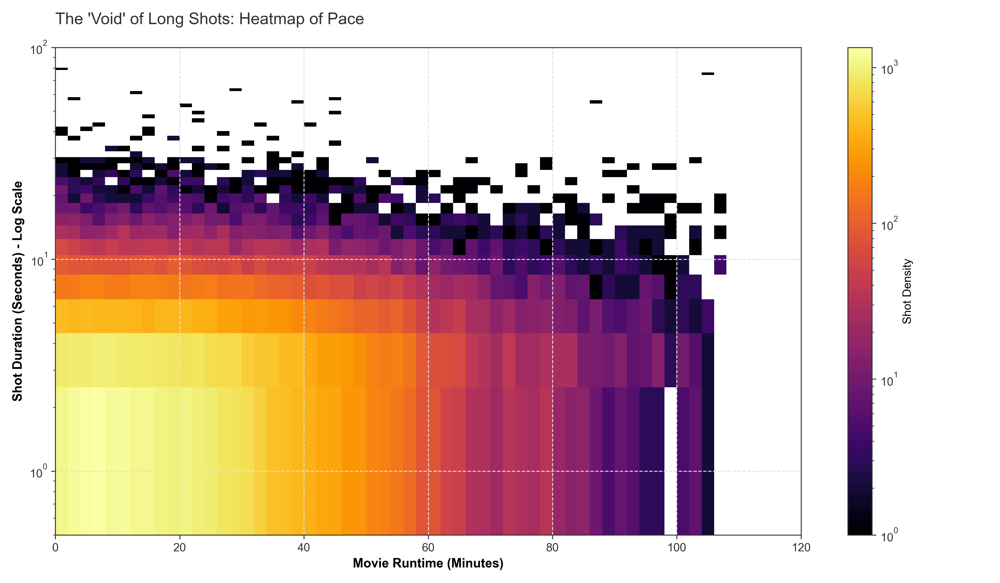
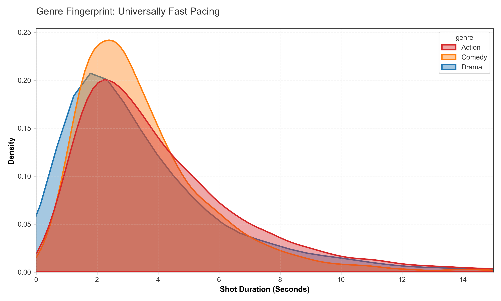
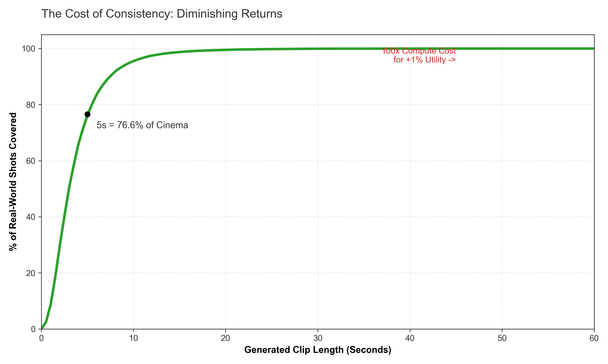

# The 20-Second Ceiling: A Statistical Analysis of Cinematic Shot Duration

## Abstract
An analysis of **57,449 shots** across modern cinema (sourced from MovieBench and Cinemetrics) reveals a statistical ceiling on shot duration. While current generative video architectures often prioritize long-context coherence (60s+), the data indicates that **95% of narrative filmmaking occurs in under 10 seconds**, with a median shot length of **3.0 seconds**.


*Figure 1: Cumulative Distribution of shot lengths. The curve asymptotes at ~10s, indicating diminishing returns for generation capability beyond this threshold.*

## Key Findings

### 1. The 3-Second Standard (N=57,449)
Aggregating shot-level data from the MovieBench dataset, we established the baseline editorial rhythm of modern cinema.

*   **Median Shot Length:** 3.00 seconds
*   **95th Percentile:** 9.64 seconds
*   **Std Dev:** 3.31 seconds

### 2. Temporal Re-Identification Frequency
If the average shot is 3 seconds, a standard 90-minute movie requires the audience to re-identify the character/context **1,800 times**.

*   **Average Cuts Per Minute:** ~15.5
*   **Implication:** State-of-the-art models typically optimize for maintaining temporal coherence for 60 seconds. However, editorial patterns suggest the challenge is re-establishing character identity every 3-4 seconds. The primary bottleneck is not long-term stability, but high-frequency re-generation with zero drift.

### 3. Analysis of Long-Tail Shot Durations
We calculated the percentage of shots that fall into the 10s - 30s duration range.

*   **Shots between 10s - 30s:** Only **4.38%** of the dataset.

**Distribution Analysis:** The bimodal distribution of filmmaking favors either short pacing shots (<5s) or extended "long takes" (>30s). The 10s-30s range represents a statistical trough in editorial grammar.

## Visualizing Data Density

We plotted 57,000 shots on a heatmap (Runtime vs. Duration). The black area at the top represents the duration range that many current models aim to simulate, which effectively does not exist in the source data of modern cinema.


*Figure 2: Heatmap of Pace. Note the dense "hot zone" at 2-5s and the lack of data density above 20s.*

## The "20-Second Ceiling" in Blockbusters
We isolated high-VFX blockbusters to test for "long take" dependency.

| Film | Median Shot | Max Shot | % Under 20s |
|------|-------------|----------|-------------|
| **Harry Potter & The Order of the Phoenix** | 3.7s | 15.2s | 100% |
| **The Bourne Ultimatum** | 1.8s | 19.7s | 100% |
| **Indiana Jones & The Last Crusade** | 2.9s | 18.4s | 100% |
| **Mad Max: Fury Road** | 2.6s | 32.9s | 99.1% |


## Visualizing Cut Density
The following visualization represents the temporal structure of *The Bourne Ultimatum*. Each vertical line represents a hard cut.


*Figure 3: Visualizing the Pulse of 'Bourne Ultimatum': 1,200 cuts in 90 minutes. A generative model must maintain consistency across this density of context switches.*

## Implications for Generative Context Windows

### A. Spatial Permanence (The "180-Degree" Rule)
In dialogue scenes, the camera typically flips 180 degrees every ~4 seconds (Shot A: Actor 1 -> Shot B: Actor 2).
*   **The Challenge:** Generative models must maintain spatial context across cuts.
*   **Implication:** The requirement is **Spatial Permanence** rather than just temporal extension. If a model regenerates the background geometry at every cut (every 4.2 seconds), spatial continuity breaks.

### B. The Action-Movement Correlation
Shorter shots generally correlate with higher pixel movement (action), while longer shots correlate with lower pixel movement (dialogue).
*   **The Insight:** Current benchmarks often prioritize duration on static or low-motion shots.
*   **The Mismatch:** The industry requirement is short duration with high motion fidelity.

### C. Editorial BPM (Beats Per Minute)
Comparing the "Tempo" of cinema vs. current generative baselines.

| Medium | BPM (Cuts/Min) |
|--------|----------------|
| **Mad Max: Fury Road** | **22.8 BPM** |
| **Industry Average** | **15.5 BPM** |
| **The Godfather** | **8.0 BPM** |
| **Generative Video Baseline** | **~1.0 BPM** |

**Conclusion:** A 15x tempo mismatch exists between narrative cinema and current long-context generation benchmarks.

## Genre Fingerprint
Does this only apply to action movies? We compared the shot length distributions of Action, Drama, and Comedy.


*Figure 4: Even "Slow Drama" peaks at ~4 seconds. The pacing constraints are universal across genres.*

## Utility of Temporal Consistency
The utility of shot generation hits diminishing returns relative to the dataset coverage.


*Figure 5: The curve shoots up to >80% coverage at 5 seconds. Extending consistency to 60s offers <1% additional dataset coverage.*

## Methodology
*   **Data Source A:** MovieBench (Shot-level annotations for 600+ films).
*   **Data Source B:** Cinemetrics (Frame-accurate editorial logs for specific case studies).
*   **Processing:** Data was normalized to remove title sequences and credits which skew duration data.

## Reproduction
1. Install dependencies: 
   ```bash
   pip install -r requirements.txt
   ```
2. Run analysis:
   ```bash
   python src/run_analysis.py
   ```
